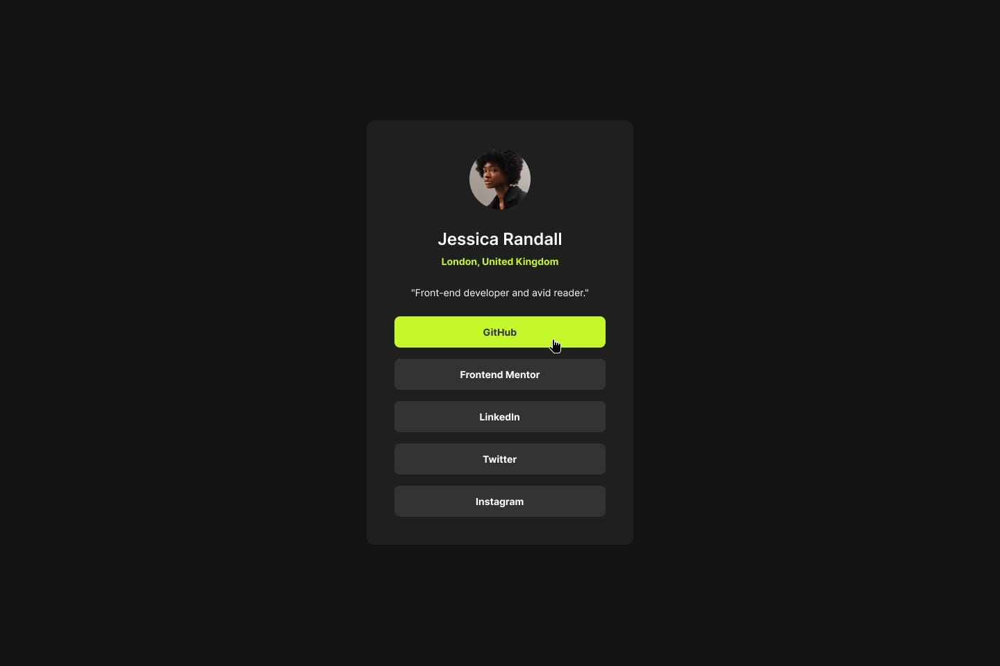

# 🚀 Social Links Profile - Desafio #3 Frontend Mentor 

Este repositório contém minha solução para o desafio **Social Links Profile** do [Frontend Mentor](https://www.frontendmentor.io/challenges/social-links-profile-UG32l9m6dQ). O objetivo é praticar HTML e CSS construindo um cartão de perfil com links sociais de forma responsiva e acessível.

---

## 📌 Desafio

O desafio era construir um componente de cartão de perfil com:

- Nome, localização e ocupação;
- Links sociais com estados de **hover** e **foco** acessíveis;
- Design responsivo (foco na versão desktop de 1440px);
- Semântica e boas práticas de HTML e CSS.

✅ O projeto foi finalizado seguindo as diretrizes visuais e técnicas propostas.

---

## 🌐 Links

- **🔗 Live Site:** [Visualizar projeto ao vivo](https://codebyneander.github.io/social-links-profile-frontend-mentor/)
- **📁 Solução no Frontend Mentor:** [Minha solução](https://www.frontendmentor.io/solutions/social-links-profile-xyz)

---

## 🛠️ Tecnologias utilizadas

- HTML5 semântico
- CSS3 com variáveis personalizadas
- Flexbox Layout
- Mobile-first approach
- Acessibilidade básica (foco, contraste e navegação)
- Google Fonts: [Inter](https://fonts.google.com/specimen/Inter)

---

## 💡 O que aprendi

- Prática com variáveis CSS e reutilização de estilos;
- Implementação de **hover** e **focus states** consistentes;
- Melhor compreensão de como entregar uma página com foco visual, mantendo contraste e hierarquia;
- Validação de acessibilidade básica com foco nos elementos interativos.
- Desenvolvimento de sites sem design com medidas detalhadas. (Figma)

---

## 🔄 Próximos passos

- Adicionar animações suaves nos botões sociais;
- Refatorar para uso com React e Styled Components em um segundo momento;
- Transformar em componente reutilizável com props e dados dinâmicos.

---

## 📚 Recursos úteis

- [Guia de acessibilidade da WAI](https://www.w3.org/WAI/)
- [CSS Tricks - Focus vs Hover](https://css-tricks.com/the-difference-between-focus-and-hover/)
- [Frontend Mentor Style Guide](https://www.frontendmentor.io/pro?ref=style-guide)

---

## 👤 Autor

- Nome: **Renan Guilherme**
- Frontend Mentor: [@renan-guilherme](https://www.frontendmentor.io/profile/renan-guilherme)
- Instagram Dev: [@renanguilherme.dev](https://instagram.com/renanguilherme.dev)
- LinkedIn: [Renan Guilherme](https://linkedin.com/in/renan-guilherme)

---

## 🙏 Agradecimentos

Agradeço ao **Frontend Mentor** pela proposta prática, e também à mim mesmo pela consistência nessa fase de evolução como dev.

---

> Projeto desenvolvido como parte do meu processo de crescimento no mundo do desenvolvimento web. Um pequeno passo no código, um salto na jornada. 🚀
